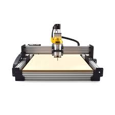

# MicroController

## All Tasks credit to Asmaa Mourad, Laila Abbas and Moaz Khairy

## Task 1

#### ESP8266 is a low-cost Wi-Fi microchip that can interface with Arduino.
#### FSR and temperature sensors are used to measure finger pressure and temperature.
#### The program run by Arduino kit takes signals from sensors, process them to get indicating numbers
#### then pass the numbers as client side by Wi-Fi through ESP to Laptop as server side.
#### On Laptop program written on MATLAB recieves these signals and plot them 

## Task 2

### Elevator Control Sequence
#### Using Arduino and Keypad

## Task 3

### CNC

<<<<<<< HEAD
#### User enter the lines to draw by MATLAB
#### then signals transmitted by Bluetooth 
#### to Arduino program to control CNC and draw the same drawing

## Task 4

### Hand Motion

#### Hand motion simulation occurs on C program using openGL
#### Then controls of the corresponding movement signals are transferred
#### to Arduino via Bluetooth module tocontrol hand action

### The system is described by two UML Diagrams :

### 1) Component Model

### 2) Use Case Model

=======
#### 
>>>>>>> 6becc909f5ecb93955416f63a7a93687fec1a183
